<div align="center">
  
</div>

<div align="center">
  
  
</div>

<h1 align="center">你好，我是九日（Sumiler） 👋</h1>

<p align="center">
  软件工程专业，当社畜中，持续构建前端、桌面端与自动化相关项目。
</p>

<p align="center">
  
</p>

## About Me

- 👀 关注方向：前端工程化、桌面应用、爬虫自动化、AI 应用落地
- 🌱 当前重点：Vue 3 / TypeScript / Electron / Playwright / NestJS
- 🧩 项目习惯：从原型验证到工程化迭代，重视可维护性和可复用性
- 📁 数据来源：以下汇总基于 `D:\Projects` 本地项目清单整理（含技术栈提取与项目归类）

#### Platforms
[](https://www.microsoft.com/windows)
[](https://nodejs.org/)
[](https://www.python.org/)
[](https://www.docker.com/)

#### Languages & Frameworks
[](https://www.typescriptlang.org/)
[](https://developer.mozilla.org/docs/Web/JavaScript)
[](https://vuejs.org/)
[](https://react.dev/)
[](https://www.electronjs.org/)
[](https://nestjs.com/)
[](https://playwright.dev/)
[](https://pptr.dev/)
[](https://scrapy.org/)
[](https://flask.palletsprojects.com/)

## 项目技术画像

- 项目总量：`34`（不含当前 GitHub 主页仓库）
- 高频技术：`TypeScript(13)`、`Python(13)`、`Node.js(12)`、`Puppeteer(9)`、`Axios(8)`、`Docker(7)`、`Playwright(6)`、`Electron(6)`、`Scrapy(4)`、`NestJS(4)`

## 项目方向汇总

- 前端应用与可视化：Vue 2/3、React、TypeScript、Vite、Pinia、Vue Router、Element Plus、Tailwind CSS
- 桌面端开发：Electron、Node.js、Playwright
- 后端与接口服务：NestJS、Express、Koa、Flask、MySQL、Redis
- 自动化与机器人：Puppeteer、Playwright、Selenium、uiautomator2、NcatBot
- 数据采集与爬虫：Scrapy、Requests、Puppeteer、Playwright
- AI 与语音能力：FunASR、PyTorch、Milvus、pycryptodome
- 工程化与部署：Docker、Turborepo、pnpm Workspace、Jest、pytest、Ruff

## 技术方向矩阵

| 方向 | 主要技术 | 说明 |
|---|---|---|
| Web 前端工程 | Vue / React / TypeScript / Vite | 覆盖后台管理、内容站点、可视化页面 |
| 桌面客户端 | Electron / Node.js / Playwright | 覆盖 AI 客户端与自动化控制工具 |
| 服务端开发 | NestJS / Express / Koa / Flask / MySQL | 覆盖鉴权、任务编排、业务 API |
| 自动化测试与机器人 | Puppeteer / Playwright / Selenium / uiautomator2 | 覆盖 Web 与移动端自动化场景 |
| 数据抓取 | Scrapy / Requests / Puppeteer | 覆盖资讯、榜单、平台内容采集 |
| AI 应用实践 | FunASR / PyTorch / Milvus | 覆盖语音识别与向量检索相关能力 |

## GitHub 数据看板

<table>
  <tr>
    <td>
      
    </td>
    <td>
      
    </td>
  </tr>
</table>

<p align="center">
  
</p>

<p align="center">
  
</p>

<p align="center">
  
</p>

## Metrics 统计信息

<p align="center">
  
</p>

## 贪吃蛇贡献图

<p align="center">
  <picture>
    <source media="(prefers-color-scheme: dark)" srcset="https://raw.githubusercontent.com/SumilerJR/SumilerJR/output/github-contribution-grid-snake-dark.svg">
    <source media="(prefers-color-scheme: light)" srcset="https://raw.githubusercontent.com/SumilerJR/SumilerJR/output/github-contribution-grid-snake.svg">
    
  </picture>
</p>

## 3D 贡献图

<p align="center">
  
</p>

## 本周编码统计（WakaTime）

<!--START_SECTION:waka-->
```text
暂未生成 WakaTime 数据。
请在仓库 Secrets 中添加 WAKATIME_API_KEY 后，运行 Waka Readme workflow。
```
<!--END_SECTION:waka-->

## 最近博客更新

<!-- BLOG-POST-LIST:START -->
- 暂无博客数据，请先在 `.github/workflows/blog-post.yml` 中配置你的 RSS 地址。
<!-- BLOG-POST-LIST:END -->

## 联系方式

- GitHub: [@SumilerJR](https://github.com/SumilerJR)
- 欢迎交流：前端工程化、桌面端产品、自动化与 AI 应用实现

> 说明：蛇形图、3D 贡献图、WakaTime、博客同步依赖 GitHub Actions。当前 WakaTime 与博客同步默认仅支持手动触发（避免未配置时报错），配置完成后可再加定时任务。

<div align="center">
  
</div>
